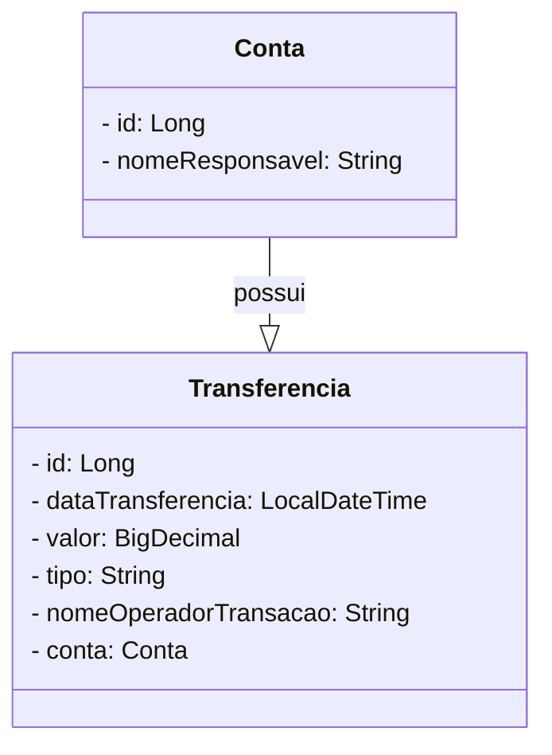

# Projeto Java-React

### Diagrama de Classe

```mermaid
classDiagram
  class Conta {
    - id: Long
    - nomeResponsavel: String
  }

  class Transferencia {
    - id: Long
    - dataTransferencia: LocalDateTime
    - valor: BigDecimal
    - tipo: String
    - nomeOperadorTransacao: String
    - conta: Conta
  }

  Conta --|> Transferencia : possui

```
